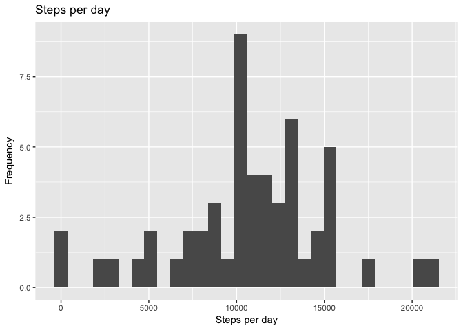
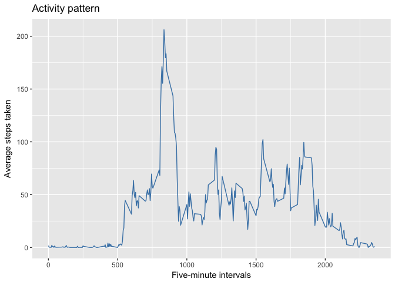
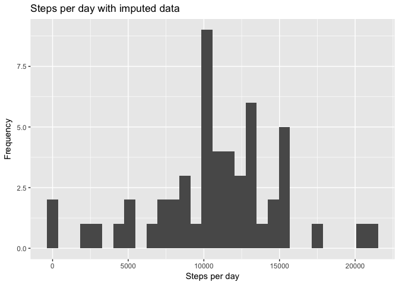
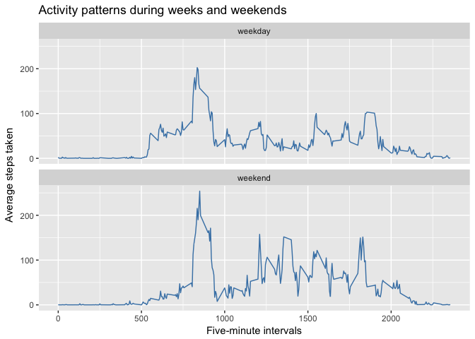

## Loading and preprocessing the data

We use some standard packages.


```r
require(dplyr)
require(ggplot2)
require(lubridate)
require(magrittr)
```

We begin by loading the data into a data frame. 


```r
act <- read.csv("activity.csv")
act %<>% mutate(date = ymd(date))
str(act)
```

```
## 'data.frame':	17568 obs. of  3 variables:
##  $ steps   : int  NA NA NA NA NA NA NA NA NA NA ...
##  $ date    : Date, format: "2012-10-01" "2012-10-01" ...
##  $ interval: int  0 5 10 15 20 25 30 35 40 45 ...
```

## What is the mean total number of steps taken per day?

We group the data by day and compute the sums. 


```r
actsum <- act %>% 
    select(steps,date) %>% 
    group_by(date) %>% 
    summarise(steps = sum(steps))
```

Now we build a histogram of the steps per day.

```r
hist <- ggplot(actsum, aes(steps)) + 
    geom_histogram(na.rm = TRUE) +
    xlab("Steps per day") + 
    ylab("Frequency") + 
    labs(title = "Steps per day") 
```

<!-- -->

The five value summary of the steps over all days includes the mean and median of all steps taken.


```r
summary(actsum$steps)
```

```
##    Min. 1st Qu.  Median    Mean 3rd Qu.    Max.    NA's 
##      41    8841   10765   10766   13294   21194       8
```

## What is the average daily activity pattern?

We construct a time series plot for the steps per 5 minute interval, averaged over all days

```r
steps5 <- act %>%
    group_by(interval) %>%
    summarise(steps = mean(steps, na.rm = TRUE)) %>%
    select(interval, steps)
timeser <- ggplot(steps5, aes(interval, steps)) + 
    geom_line(colour = "steelblue") + 
    xlab("Five-minute intervals") + 
    ylab("Average steps taken") + 
    labs(title = "Activity pattern")  
```

<!-- -->

As we can see from the plot, activity begins around interval #500, peaks out around #800, and trails off around #1900. Let us compute the interval with the maximum average steps. 


```r
steps5$interval[which.max(steps5$steps)]
```

```
## [1] 835
```

That is, #835 is the interval with the maximum average number of steps taken. 

## Imputing missing values

The total number of rows in the data set with missing values is 2304. We shall set them to the mean of the steps taken in that time interval.

```r
impact <- act %>%
    mutate(steps = ifelse(is.na(steps),filter(steps5, interval == interval)$steps,steps))
str(impact)
```

```
## 'data.frame':	17568 obs. of  3 variables:
##  $ steps   : num  1.717 0.3396 0.1321 0.1509 0.0755 ...
##  $ date    : Date, format: "2012-10-01" "2012-10-01" ...
##  $ interval: int  0 5 10 15 20 25 30 35 40 45 ...
```

Now we build a histogram of the steps per day using the new data set.

```r
impactsum <- impact %>% 
    select(steps,date) %>% 
    group_by(date) %>% 
    summarise(steps = sum(steps))
imphist <- ggplot(actsum, aes(steps)) + 
    geom_histogram(na.rm = TRUE) +
    xlab("Steps per day") + 
    ylab("Frequency") + 
    labs(title = "Steps per day with imputed data")
```

<!-- -->

The five value summary of the steps over all days includes the mean and median of all steps taken.


```r
summary(impactsum$steps)
```

```
##    Min. 1st Qu.  Median    Mean 3rd Qu.    Max. 
##      41    9819   10766   10766   12811   21194
```

The influence of the imputed missing data on the mean and median of the daily steps is minimal.

## Are there differences in activity patterns between weekdays and weekends?

We create a factor variable in the data set indicating whether the date is on a weekend day or not. 


```r
impact %<>% mutate(wd = as.factor(ifelse(wday(date) %in% c(6,7), "weekend", "weekday")))
str(impact)
```

```
## 'data.frame':	17568 obs. of  4 variables:
##  $ steps   : num  1.717 0.3396 0.1321 0.1509 0.0755 ...
##  $ date    : Date, format: "2012-10-01" "2012-10-01" ...
##  $ interval: int  0 5 10 15 20 25 30 35 40 45 ...
##  $ wd      : Factor w/ 2 levels "weekday","weekend": 1 1 1 1 1 1 1 1 1 1 ...
```

Now we average the steps taken per five-minute interval, grouped by week and weekend days and create a panel plot of these corresponding activity patterns. 


```r
steps5wd <- impact %>%
    group_by(interval, wd) %>%
    summarise(steps = mean(steps)) %>%
    select(wd, interval, steps)
timeserwd <- ggplot(steps5wd, aes(interval, steps)) + 
    geom_line(colour = "steelblue") + 
    facet_wrap(~wd, nrow = 2) + 
    labs(x = "Five-minute intervals") + 
    labs(y = "Average steps taken") + 
    labs(title = "Activity patterns during weeks and weekends")   
```

<!-- -->

On average, there is more activity on the weekend, both overall and in the peaks. The activity starts later and ends a little earlier, but reaches its peak around the same time. 


